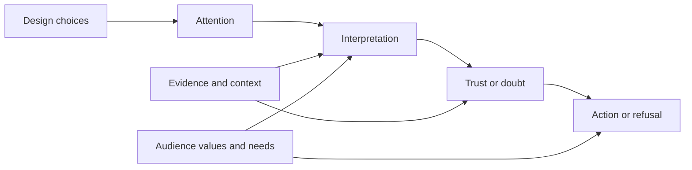

# Chapter 1: Persuasion, Branding, and Design

Persuasion is the practice of helping shape what people notice, how they interpret it, whether they trust it, and what they decide to do next. Every designed message has some persuasive effect, even when it does not look like an advertisement. A menu guides a choice. A campus map directs movement. A product package suggests who the product is for.

That does not make persuasion automatically good or bad. It makes persuasion a responsibility. Designers work with attention, meaning, and action, so they need to understand both the tools and the boundaries.

## One Product, Many Meanings

Imagine a plain white T-shirt. The shirt itself stays exactly the same: same fabric, same cut, same color. What changes is the frame around it.

- **A practical frame:** “The everyday white T-shirt: durable, washable, and easy to layer.”
- **A status frame:** “A precise essential, selected by people who appreciate restraint.”
- **An ethical frame:** “A white T-shirt made with documented labor and lower-impact materials.”
- **A nostalgic frame:** “The shirt that belongs in every summer photo.”
- **A discount frame:** “A five-dollar basic, available while supplies last.”

The physical product has not changed. Attention, interpretation, trust, and action may change because the words, images, evidence, price, placement, and surrounding identity have changed. This is the central relationship among persuasion, branding, and design: design gives an idea a visible form, branding gives it a recognizable meaning, and persuasion helps that meaning matter to a particular person.

Framing is not the same as lying. A frame can select a true and relevant aspect of a product. It becomes deceptive when it hides material facts, implies evidence that does not exist, or creates a belief the designer knows is false.

## Persuasion, Coercion, and Manipulation

Persuasion leaves room for judgment. The audience can understand the offer, consider alternatives, and say no without being punished. Coercion removes meaningful choice through force, threats, or severe pressure. Manipulation may leave a formal choice but interferes with informed judgment by hiding important information, exploiting vulnerability, or steering someone through confusion and deception.

| Approach | How it works | What happens to choice? | White T-shirt example |
| --- | --- | --- | --- |
| Ethical persuasion | Presents a meaningful reason, evidence, and a clear invitation | The person can evaluate and decline | “This shirt is made from certified organic cotton; see the material and care details.” |
| Coercion | Uses force, threat, punishment, or extreme pressure | Choice is constrained or removed | “Buy this shirt or lose access to a necessary service.” |
| Manipulation | Conceals, distorts, or exploits information or emotion | Choice may look open but is not well informed | A countdown resets every minute to create fake scarcity. |

The same technique can move across these categories depending on context. Scarcity can be useful when inventory is genuinely limited. It becomes manipulative when a designer invents a deadline. A bold headline can clarify a benefit. It becomes deceptive when it makes a minor feature sound like the whole truth.

## Cialdini’s Principles of Influence

Robert Cialdini’s commonly taught principles describe patterns that often affect people’s decisions. They are not magic buttons, and they do not guarantee compliance. They are better understood as reasons people may find a message more credible, relevant, or motivating.

1. **Reciprocity:** People often feel inclined to return a benefit or favor. A brand might offer a useful repair guide before asking someone to buy a shirt. The ethical question is whether the gift is genuinely useful and whether the request is clear.
2. **Commitment and consistency:** After making a voluntary choice, people often prefer actions that fit with it. A shopper who chooses a lower-waste laundry guide may be more interested in a long-lasting shirt. Designers should not turn a small action into a trap or imply a commitment that was never made.
3. **Social proof:** When uncertain, people often look to what others do or approve. Reviews, customer counts, and photographs can help, but they should represent real experiences rather than invented consensus.
4. **Liking:** People are more open to messages from sources they like or identify with. A familiar campus organization may make a T-shirt feel more relevant than an unknown seller. Liking should not be manufactured through false intimacy or disguised advertising.
5. **Authority:** Expertise, credentials, and reliable evidence can guide decisions. A textile specialist explaining fabric care is more useful than a celebrity presented as a technical expert. Authority needs to be relevant to the claim.
6. **Scarcity:** Limited availability can increase perceived value and urgency. “Only 12 left in this size” is informative if accurate. “Last chance” is misleading when the same stock will be offered again tomorrow.
7. **Unity:** People are influenced by a sense of shared identity or belonging. A shirt framed as part of a first-generation student community may carry meaning beyond its fabric. Unity is ethical when the group identity is real and inclusive, not when it is used to shame outsiders.

These principles overlap. A student-designed shirt may use social proof through real student reviews, authority through transparent production details, and unity through a genuine campus identity. The more principles a message combines, the more important it is to examine whether the audience still has an honest, understandable choice.

## Two More Useful Concepts

### Framing and loss aversion

Framing changes how the same facts are presented. “Keeps its shape through 50 washes” emphasizes a gain in durability. “Replace fewer shirts over the year” emphasizes avoiding a loss or waste. Behavioral economics calls attention to **loss aversion**: losses often feel more significant than equivalent gains. This can help a designer communicate a real cost, but fear should not be inflated to force a purchase.

For the white T-shirt, a responsible frame might say: “A $25 shirt designed to last longer may cost less per wear than replacing several $8 shirts.” That claim needs support. The designer should show how the comparison was calculated rather than using “cost per wear” as decoration.

### The elaboration likelihood model

The **elaboration likelihood model** describes two broad ways people process messages. With a central route, people think carefully about evidence and arguments. With a peripheral route, cues such as attractiveness, familiarity, social approval, or ease influence judgment when attention or motivation is lower.

Someone comparing fabric weights and care instructions is using more central processing. Someone quickly noticing a trusted campus logo may be responding to a peripheral cue. Good design can support both: make the first impression inviting, then make the evidence easy to inspect. A polished photograph should lead to clear material, price, and return information, not replace it.

## A Simple Persuasion System

This is not a guaranteed sequence. People can ignore a message, reinterpret it, distrust it, or act for reasons the designer did not expect. The diagram is useful because it reminds us that changing a color or headline can affect more than attention. It can also affect what the product seems to mean and whether the audience believes the claim.

## Designing the White T-Shirt Honestly

Suppose a designer is launching the same plain white T-shirt in three settings:

- In a **workwear shop**, the layout might foreground fabric weight, reinforced seams, sizing, and washing instructions.
- At a **student orientation**, the layout might foreground affordability, easy care, and how the shirt fits into campus life.
- In a **sustainability collection**, the layout might foreground material sourcing, production evidence, durability, and repair options.

These are different persuasive approaches, but they do not require different facts. The designer changes emphasis to match a real audience need. That is branding at its best: not pretending the shirt is a different object, but making a coherent promise about why this object belongs in someone’s life.

Ethical design also includes accessibility and inclusion. Text must be readable, claims must not depend only on color, interfaces should not hide essential information behind difficult interactions, and a sense of community should not imply that people outside the target group are lesser. Persuasion should respect the audience’s time, attention, privacy, money, and ability to make an informed decision.

## Questions to Ask Before Persuading

Before choosing a headline, image, button, layout, or influence principle, a designer should ask:

- What action am I inviting, and is it genuinely in the audience’s interest as well as the organization’s?
- What do I want people to notice, believe, trust, and do?
- Which facts support the promise, and can the audience find those facts easily?
- What important limitation, cost, uncertainty, or alternative might my design hide?
- Am I using a real signal of scarcity, expertise, popularity, or belonging?
- Can someone decline without embarrassment, penalty, confusion, or repeated pressure?
- Who might be especially vulnerable to this message, and how could the design affect them?
- Would I describe the tactic plainly to the person seeing it?
- If the white T-shirt stays the same, what exactly am I changing: emphasis, evidence, identity, or emotion?

The last question is especially useful. It separates a legitimate change in framing from an attempt to make a weak product appear to be something else.

## Explore Further

Search for reliable books, library databases, and university or professional sources using suggestions such as:

- “Robert Cialdini principles of influence primary research and criticism”
- “ethical persuasion versus manipulation design”
- “elaboration likelihood model central peripheral route overview”
- “loss aversion framing effect behavioral economics research”
- “dark patterns user experience ethics”
- “branding meaning identity communication design”

Compare sources rather than relying on a single summary. Look for definitions, evidence, limitations, and examples of where a concept does not apply.

## What You Should Remember

Persuasion shapes attention, interpretation, trust, and action, but it should preserve informed choice. Branding frames what a product means without changing the product itself. Cialdini’s principles, framing, loss aversion, and the elaboration likelihood model help explain why messages work. Use them to clarify real value, support honest decisions, and respect the people your design is asking to act.
