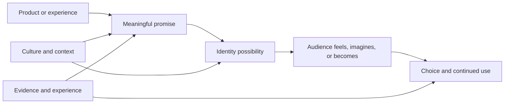

# Chapter 2: Brand Archetypes

A brand archetype is a generalized cultural and narrative pattern that helps people recognize what a product, organization, or experience seems to stand for. The Explorer suggests discovery. The Sage suggests understanding. The Caregiver suggests support. These patterns work because people have encountered similar roles in stories, communities, institutions, and everyday life.

Archetypes are not personality tests for companies, and they are not rigid categories of human personality. They are interpretive tools. A designer uses one to make a promise more coherent: “This is the kind of experience you can expect here.” The practical question is:

> What does the audience get to feel, imagine, or become by choosing this brand?

## The Same Shirt, Different Story

Return to the plain white T-shirt. Nothing about the shirt changes: the fabric, cut, color, and construction are identical. What changes is the story surrounding it. 

An **Explorer** version might appear in a field journal beside a backpack: “One reliable layer for wherever the day leads.” The audience gets to imagine movement, independence, and possibility.

A **Sage** version might appear in a carefully organized guide to fabric weight, fit, care, and material sourcing: “Understand what you wear.” The audience gets to feel informed and capable of making a considered choice.

A **Rebel** version might be photographed in a stark, high-contrast campaign that questions seasonal overconsumption: “Wear the essential. Reject the disposable.” The audience gets to imagine resistance to excess and membership in a challenge to convention.

The shirt is still plain and white. Archetypal positioning changes the meaning attached to it. It helps organize language, photography, packaging, retail environment, and customer experience around a recognizable role.

## A Working Set of Archetypes

The twelve archetypes below are common starting points for brand and communication work. They are not a universal law or a complete list. Their value comes from giving a team shared language for discussing meaning.

| Archetype | Core orientation | Audience may feel, imagine, or become | White T-shirt direction |
| --- | --- | --- | --- |
| **Explorer** | Freedom, discovery, independence | Adventurous, self-directed, ready for what is next | A dependable layer for travel, motion, and open-ended days |
| **Sage** | Truth, understanding, expertise | Informed, thoughtful, able to judge for themselves | Clear specifications, comparisons, and care knowledge |
| **Creator** | Imagination, expression, making | Original, expressive, capable of shaping something new | A blank foundation for customization and personal style |
| **Ruler** | Order, standards, responsibility | In control, discerning, confident in quality | Precise fit, restrained presentation, and dependable standards |
| **Caregiver** | Service, protection, support | Looked after, generous, attentive to others | Comfortable basics chosen for durability and shared use |
| **Rebel** | Defiance, disruption, freedom from convention | Bold, independent, willing to challenge the usual | An essential that rejects wasteful fashion cycles |
| **Hero** | Courage, effort, improvement | Capable, determined, ready to meet a challenge | A reliable shirt for practice, work, or purposeful effort |
| **Everyperson** | Belonging, equality, familiarity | Included, understood, comfortable among others | An accessible staple that fits ordinary daily life |
| **Innocent** | Simplicity, optimism, goodness | Fresh, hopeful, relieved from unnecessary complexity | Clean design, easy care, and an uncomplicated promise |
| **Jester** | Play, humor, lightness | Amused, spontaneous, free to be less serious | A simple shirt made lively through wit, color, or playful styling |
| **Lover** | Connection, pleasure, beauty | Attracted, appreciated, present to sensory experience | Softness, fit, texture, and intimate attention to detail |
| **Magician** | Transformation, possibility, wonder | Surprised, empowered, able to see a new possibility | A basic that changes how the wearer sees or uses an everyday object |

The descriptions are starting hypotheses, not instructions to stereotype an audience. An Explorer brand does not need mountains, and a Caregiver brand does not need sentimental language. The archetype should emerge from the relationship the brand is trying to create.

## From Product to Identity

Archetypes connect practical features to a larger sense of self. A T-shirt’s softness is a feature. “I choose comfort and make room for others” is an identity possibility. Neither meaning is guaranteed by the object alone; it is built through repeated signals and experiences.

Consider the three white T-shirts again. The Explorer promise turns the shirt into a companion for movement. The Sage promise turns it into an object worth understanding. The Rebel promise turns it into a small statement against excess. The product-to-identity path is persuasive only when the actual experience supports the promise. A shirt advertised as durable but quickly falling apart creates a gap between meaning and evidence.

## Archetypes Are Not Destiny

An archetype does not determine everything a brand says or does. A person may be curious like an Explorer, careful like a Sage, and playful like a Jester. A brand may also contain multiple tendencies. A public library might be primarily Sage and Caregiver, with Creator energy in its workshops and Everyperson energy in its open access.

The goal is not to force a brand into one box. The goal is to choose a dominant pattern and understand its supporting patterns. One archetype can guide the central promise while another shapes the tone or the experience. For example, a white T-shirt collection could be primarily Caregiver because it emphasizes comfort and repair, with Sage as a supporting tendency because it explains materials and care honestly.

Culture matters too. Symbols of authority, rebellion, purity, luxury, family, or independence do not mean exactly the same thing everywhere. A visual style that feels playful to one audience may feel childish to another. A claim about individual freedom may be attractive in one context and feel isolating in another. Archetypes are shared patterns, but their expression must be interpreted within a specific cultural and historical setting.

This is also why designers should avoid treating archetypes as shortcuts for demographic assumptions. Age, gender, nationality, class, disability, and other social identities do not automatically determine which archetype a person prefers. Listen to the audience, study the context, and test the interpretation.

## Making an Archetype Practical

Choose an archetype by starting with the audience’s desired experience, not with a mood board. Ask what the audience should feel before, during, and after interacting with the brand. Then translate that promise into observable choices.

For the identical white T-shirt:

- **Explorer:** Use open space, useful packing details, a story about adaptability, and images of the shirt moving through varied settings. Do not promise adventure while offering poor sizing or unreliable delivery.
- **Sage:** Use readable specifications, comparisons, testable claims, and calm explanations. Do not hide uncertainty behind an expert tone.
- **Rebel:** Use a direct challenge to disposable habits, unusual but legible composition, and evidence of the alternative being proposed. Do not confuse being offensive with being independent.
- **Everyperson:** Use familiar language, accessible pricing information, inclusive representation, and a straightforward purchase path. Do not treat “ordinary” as meaning bland or culturally neutral.

The archetype should guide the whole system, not just the logo. Product details, customer service, photography, interface behavior, retail space, and after-purchase support all contribute to the meaning people experience.

## Questions to Ask When Choosing an Archetype

- What does the audience get to feel, imagine, or become by choosing this brand?
- What real need or desire does that promise address?
- Which archetype best describes the relationship we want to create, and which tendencies support it?
- What evidence in the product or experience makes the archetype believable?
- What would the white T-shirt mean under this archetype, and what would remain unchanged?
- Which words, images, materials, interactions, and service behaviors would consistently express the promise?
- How might this archetype be interpreted differently by different cultural groups or communities?
- Are we inviting identification, or are we pressuring people to prove that they belong?
- What stereotypes or exclusions might this framing accidentally reproduce?
- Could the audience understand the promise without knowing the archetype vocabulary?
- What would disconfirm our interpretation when we test it with real people?

The final question keeps archetypes grounded. A designer’s intention is only one part of meaning. The audience’s experience is the test.

## Ethical Limits

Archetypes can make communication clearer, but they can also flatten people into costumes. A Rebel campaign can romanticize risk. A Caregiver campaign can pressure people into self-sacrifice. A Lover campaign can reduce value to appearance. A Ruler campaign can make exclusion look like quality. These risks do not mean the archetypes are unusable; they mean their consequences should be examined.

Do not make promises the product cannot keep. Do not use belonging to shame people who decline. Do not imply that buying a shirt makes someone courageous, ethical, intelligent, or superior without giving them a meaningful way to practice those values. Identity-based design can invite participation, but it should not turn consumption into a test of moral worth.

## What You Should Remember

Brand archetypes are generalized cultural and narrative patterns that help organize recognizable meaning. They are flexible tools, not fixed personality categories or destiny. A brand may combine several tendencies, and culture changes how those tendencies are understood. Start with the audience’s desired feeling, imagination, or identity, then make the promise visible across the whole experience. The plain white T-shirt proves the point: the product can stay the same while its meaning changes dramatically.