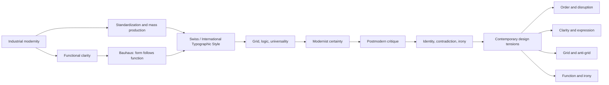

# Chapter 3: Design Language and the Idea of Form

Visual design does not just decorate information. It carries ideas about how the world is organized, what is important, what counts as trustworthy, and what kind of people belong in a scene. A poster, a typeface, a web page, or a product label is not neutral. It is a way of telling the viewer, “This is the kind of object this is,” “This is the kind of mind that belongs here,” or “This is the kind of future we believe in.”

A first-year student can learn to see this by asking a simple question: What is this design trying to make people feel about the world?

## From Early Modernism to the Modernist Promise

The modernist period emerged in the late nineteenth and early twentieth centuries during a world shaped by industrialization, urban growth, scientific thinking, and the belief that new systems could improve life. Design responded by trying to reduce clutter, clarify structure, and connect form to purpose.

Two ideas mattered most:

- Design should be honest about materials, structure, and function.
- A clear visual system can help everyone understand the same information in the same way.

This does not mean early modernism produced a single style with no variation. It produced a family of beliefs: that rational organization can improve everyday life, that typography can be more legible and efficient, that clean geometry can signal order and trust, and that form should follow use rather than decoration.

The rise of industrial production made these ideas practical. Designers had to organize information so it could be reproduced, standardized, and read quickly. Type became more systematic. Layouts became more disciplined. Buildings, posters, and objects were shaped by grids, modular proportions, and cleaner typefaces.

## Bauhaus: Form, Function, and the Idea of a Better World

The Bauhaus, founded in Germany in 1919, became the most famous school for this way of thinking. Its faculty and students brought together crafts, industrial design, architecture, painting, and typography. They believed that art and industry could work together rather than remain separate.

The Bauhaus was not simply about making things look “modern.” It proposed a broader idea: the visual world could be ordered, rational, and useful. It favored clear forms, honest materials, and the search for an underlying structure that could guide design across many different uses.

This mindset shaped:

- sans-serif typography as a signal of modern clarity
- modular layouts and disciplined composition
- a belief that design could serve society as well as commerce
- a strong connection between aesthetics and everyday life

The Bauhaus influence was not only visual. It was intellectual. It argued that designers could learn from geometry, manufacturing, and human needs instead of relying on inherited decoration or academic ornament.

## Swiss / International Typographic Style: Order as a Design System

In the mid-twentieth century, designers in Switzerland developed what is often called the Swiss or International Typographic Style. This approach pushed modernist ideals even further. It favored asymmetrical layouts, clear hierarchy, strong grids, objective typography, and disciplined spacing.

The style often relied on:

- sans-serif typefaces such as Helvetica and Univers
- modular or mathematical spacing systems
- generous margins and strong alignment
- a clear separation among headings, text, and captions
- ordering information so it could be read quickly and consistently

This style became highly influential in corporate identity, posters, magazines, signage, and early digital interfaces. It communicated confidence, order, neutrality, and legibility. A page designed in this mode often seemed to say: “This information is organized so you can trust it.”

The idea of universality was powerful. If a grid can organize content across languages, cultures, and scales, then design can become a general tool for clarity. That is part of why the Swiss style had such a strong legacy in modern information design.

## Postmodernism: A Reaction Against the Certainty of Modernism

Postmodernism emerged partly as a challenge to modernist confidence. If modernism often treated clarity, function, order, and universal principles as if they were objective truths, postmodernism questioned that certainty.

A postmodern designer might say:

- not all systems are neutral
- not all order is liberating
- universal standards can erase identity and cultural difference
- restraint can become a kind of authority that excludes other voices
- signs can carry contradiction, humor, or irony

This is not a simple rejection of modernism. Postmodern design often uses modernist tools while changing their meaning. A grid may still be used, but not as a totalizing system. A sans-serif typeface might be paired with a playful visual reference. A strong layout might be broken by color, collage, or references to popular culture.

Postmodern design often values ambiguity, layering, and context. It suggests that identity is not a single universal standard but a mix of history, culture, place, and personal expression.

## The Design Tension That Continues

The most useful way to understand design history is not as a march toward one final style. It is a continuing argument among opposing values.

| Tension | Modernist emphasis | Postmodern or contemporary response | Example in everyday design |
| --- | --- | --- | --- |
| Order and disruption | Clear systems, hierarchy, control | Break the system, add friction, make the message unstable | A product page that uses a strict grid but interrupts it with a bold, humorous headline |
| Universality and identity | Standardized communication for everyone | Design that recognizes culture, context, and difference | Brand systems that adapt to local languages or community-specific references |
| Clarity and expression | Reduce noise, improve legibility | Let emotion, tone, and personal voice remain visible | Editorial design that uses expressive typography without losing readability |
| Grid and anti-grid | Structure and alignment | Collage, irregularity, tension, asymmetry | Websites that mix neat modules with intentionally off-balance images |
| Restraint and abundance | Minimalism, control, focus | Layered meaning, more signals, more visual noise | App interfaces that combine clean navigation with playful graphics, color, and motion |
| Function and irony | Make it useful and truthful | Use irony to question authority or add cultural commentary | A technology product that references retro design while still performing a useful task |

These tensions are not dead historical debates. They are everyday design issues. A contemporary interface, a museum exhibition, a clothing label, or a brand identity all negotiate them in different ways.

## A Concept Map of the Story

This map is not a claim that one style replaced another. It is a way of seeing how design ideas evolve through argument, not through a single straight line.

## How to Read a Design

When you encounter a design, do not ask only, “Is it attractive?” Ask how it makes a claim about the world.

Start with the basics:

- What is the primary function? Is this design mainly informational, persuasive, expressive, or operational?
- What visual system does it rely on? Is it highly structured, asymmetrical, playful, minimal, chaotic, or layered?
- What does the typography suggest? Does it feel objective, historical, personal, mechanical, hand-drawn, or authoritative?
- What is the role of the grid? Is the layout disciplined, deliberate, or intentionally breaking its own order?
- What is the relationship between content and decoration? Is decoration serving meaning, or is it obscuring it?
- What might the designer be trying to say about identity, culture, or trust?
- What does the design assume about its audience? Does it presume expertise, conformity, accessibility, or a particular lifestyle?

A good design critic does not just notice style. A good critic asks what the style is doing socially and intellectually.

## Museum Research

To study design seriously, students should look beyond the classroom and into collections that document design history with real objects, records, and institutional context.

Search for authentic examples in credible museum and institutional collections such as:

- The Metropolitan Museum of Art
- The Museum of Modern Art (MoMA)
- Cooper Hewitt, Smithsonian Design Museum
- Victoria and Albert Museum (V&A)
- Bauhaus-related archives and collections
- other university, museum, or design-institution collections with catalog records and object descriptions

Use search terms such as:

- “modernist poster design”
- “Bauhaus typography archive”
- “Swiss graphic design poster”
- “International Typographic Style exhibition catalog”
- “postmodern design identity system”
- “design history grid typography modernism”
- “museum collection Bauhaus chair”
- “Cooper Hewitt modern design objects”
- “V&A graphic design archive”

These are starting points, not proof. Always verify the actual object, collection record, institution, and date yourself. Do not treat a search result or a keyword alone as evidence. Look for museum object records, catalog descriptions, institution names, and the full context around the work.

The key lesson is that historical design becomes meaningful when you can connect a visual style to the actual cultural conditions that produced it.

## The Plain White T-Shirt Again

Return to the simple white T-shirt. It does not change physically, but the way it is presented can make it feel like a completely different product.

A modernist presentation might emphasize:

- a clean white background
- strong alignment and a strict grid
- minimal branding
- one clear hierarchy: product name, material, size, and fit
- a serious tone about durability, function, and utility

In that frame, the shirt feels like a rational object: efficient, honest, universal, and trustworthy. It looks like a tool for everyday life. It belongs to a design language that says the product should be clear, durable, and quietly useful.

A postmodern presentation might instead use:

- a collage of references, textures, or found imagery
- playful or ironic typography
- unexpected combinations of color, contrast, or cultural references
- a layout that breaks the grid or uses contradiction deliberately
- a message that questions consumption, identity, or taste

In that frame, the same white T-shirt feels like a statement about culture, identity, and attitude. It may seem witty, self-aware, or even critical of the idea of a perfect universal basic. The same shirt becomes a different product because the visual language around it changes what it means.

This is the heart of design language: the object stays the same, but the idea around it changes the value, identity, and narrative it carries.

## Contemporary Web and Product Design

History did not end with a single set of rules. Contemporary design continues to move between order and disruption, restraint and abundance, function and irony. Web interfaces often borrow modernist clarity for usability while layering in expressive typography, playful interactions, or identity-driven branding. Product design often mixes minimal structure with cultural references or symbolic tension.

A successful contemporary designer knows that a system can be useful without being sterile, and expressive without becoming confusing. The goal is often not to pick one side of the conflict once and for all. It is to choose where the work needs clarity, where it needs voice, and where it needs an intentional break in the pattern.

That is why modernism remains relevant even in a postmodern context. It still offers tools for legibility, structure, and trust. But contemporary designers also know that identity, culture, and contradiction are part of the visual world. A clean system is not automatically honest, and a bold disruption is not automatically meaningful.

## What You Should Remember

Design is never just decoration. It is a way of organizing meaning. Early modernism emphasized function, order, clarity, and universality. Bauhaus thinking pushed those ideas into the relationship between art, craft, and industry. The Swiss / International Typographic Style made those principles highly systematic through grids, hierarchy, and objective typography. Postmodernism responded by questioning modernist certainty, showing how identity, contradiction, irony, and cultural context disrupt the idea of one universal truth.

The visual creative tensions that matter most are still active:

- order and disruption
- universality and identity
- clarity and expression
- grid and anti-grid
- restraint and abundance
- function and irony

The plain white T-shirt shows that a product can remain identical while its meaning changes completely because of framing, style, and the values embedded in the design system. Good designers study the history, learn the terms, and ask what a design is trying to make people believe, value, and do.
