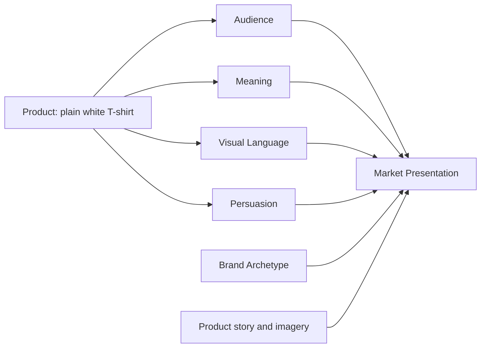

# Chapter 4: One Shirt, Four Very Different Stories

A plain white T-shirt is the perfect design test because it is almost impossible to hide the role of presentation. The product is the same item of clothing. The story around it is different. A designer can make that same shirt feel like a tool of precision, a status object, a rebellious statement, a lifestyle fantasy, or a piece of cultural irony. The shirt does not change. The meaning does.

This chapter looks at four radical presentations of one ordinary, high-quality white T-shirt. The goal is not to say one version is “correct.” The goal is to show how design language, audience, and persuasion work together to create value.

## Concept 1: The Honest Utility Shirt

### Audience
Students, commuters, travelers, people who want everyday reliability and no fuss.

### Chosen brand archetype
Sage

### Persuasion principles being used
- clarity and usefulness
- authority through transparent material details
- social proof through practical reviews and repeated use
- commitment and consistency through the idea of building a dependable wardrobe

### Visual-design language
Restrained modernist / Swiss-influenced. Clean grid. Strong hierarchy. High whitespace. Sans-serif type. Quiet color palette: white, charcoal, soft gray, a small accent of blue or black.

### Headline
“Built for the day, not the trend.”

### Short product story
This shirt is presented as a durable, comfortable base layer for ordinary life. It is not trying to be dramatic. It is trying to be trusted. The story is that useful work clothes and everyday essentials deserve thoughtful construction and clear information.

### Imagery direction
A series of close, matter-of-fact photographs. The shirt seen folded neatly, worn in a hallway, under a jacket, on a commuter train, or on a student walking to class. No exaggerated poses. No fashion theatrics. Clean product details and fabric close-ups.

### What meaning the customer is actually being invited to buy
The customer is being invited to buy a feeling of competence and practical wisdom. “I do not chase trends. I choose what works.” The shirt becomes less about identity performance and more about rational choice and everyday confidence.

### Ethical concern or possible misuse
The risk is that this style of presentation can be too polished, creating a false sense of moral superiority. A brand may imply that being practical and restrained is inherently smarter or better than caring about expression or pleasure. The shirt should not hide real manufacturing questions behind a calm aesthetic.

## Concept 2: The Explorer Shirt

### Audience
People who want mobility, independence, and the feeling of being ready for whatever the day brings.

### Chosen brand archetype
Explorer

### Persuasion principles being used
- aspiration and self-direction
- social proof through lifestyle imagery and “seen in the field” narratives
- scarcity through limited seasonal runs or small-batch production
- unity through belonging to a community of people who prefer movement over stasis

### Visual-design language
Open, atmospheric, tactile, and outdoorsy. Wide margins, strong photography, warm neutrals, muted earth tones, map-like layouts, and small field notes or route references.

### Headline
“Take the everyday farther.”

### Short product story
This shirt is sold as a reliable companion for movement. It is not only clothing; it is equipment for an active life. The story says the shirt is made for early starts, long walks, train platforms, open roads, and the everyday courage of going somewhere with purpose.

### Imagery direction
Outdoor scenes: a shirt worn during a morning commute, a trail walk, a café stop after a long bike ride, or a road trip with pack, map, and sunlight. The shirt should look like it belongs to action, not decoration. The photograph should suggest independence and readiness.

### What meaning the customer is actually being invited to buy
The customer is buying permission to imagine themselves as capable, self-directed, and alive to possibility. Not just a shirt, but a version of the self that can handle open space and uncertainty. The product promises freedom, not just fabric.

### Ethical concern or possible misuse
The risk is that the brand may romanticize movement and independence while ignoring real limits. It can sell a fantasy of adventure to people who cannot safely travel or who simply need durable basics for ordinary life. It can also turn a basic garment into a status marker for “authentic” lifestyles.

## Concept 3: The Rebel / Anti-Consumer Shirt

### Audience
Young adults, creative workers, students, and people who want to reject disposable fashion habits.

### Chosen brand archetype
Rebel

### Persuasion principles being used
- scarcity and anti-status messaging
- social proof through community values and visible participation
- commitment and consistency through a “reject the waste” stance
- loss aversion through the idea of avoiding a cycle of endless consumption

### Visual-design language
Disruptive, high-contrast, intentionally anti-fashion. Rough textures, layered type, oversized slogans, asymmetry, photocollage, loud black and white or acid color combinations, slogans that challenge the usual assumptions of retail presentation.

### Headline
“Wear the essential. Cancel the cycle.”

### Short product story
This shirt is a protest against cheap, disposable fashion. It is not sold as a luxury object, but as a practical refusal. The story presents the shirt as a small but meaningful act of resistance against overproduction and a culture that treats clothing as temporary novelty.

### Imagery direction
An unpolished, skeptical, campaign-like aesthetic: oversized type, torn paper textures, warehouse walls, thrift-store references, or stacked piles of discarded clothing photographed in stark contrast. The shirt might appear in a way that explicitly questions standard retail glamour.

### What meaning the customer is actually being invited to buy
The customer is paying for moral self-positioning. They are not merely buying a shirt; they are joining a community of people who oppose waste, hype, and trend-chasing. The shirt becomes a visible symbol of refusal.

### Ethical concern or possible misuse
This concept can become performative without substance. A brand may use rebellion as a marketing style while still overproducing the same product or relying on guilt rather than honest material information. It may also alienate people who are simply trying to buy practical basics by making them feel morally inadequate.

## Concept 4: The Cultural Comment Shirt

### Audience
People interested in design, irony, identity, and visual culture; students, creatives, and shoppers who enjoy a self-aware object that signals taste and contradiction.

### Chosen brand archetype
Magician or Jester, depending on emphasis

### Persuasion principles being used
- liking through artistic credibility and wit
- authority through cultural references and the implication of taste
- scarcity through limited-edition drops
- unity through membership in a design-aware community

### Visual-design language
Disruptive or postmodern. Layered collage, contradictory references, off-register typography, unexpected color combinations, playful but controlled chaos, references to art history, popular culture, and print culture without becoming random.

### Headline
“Wear the blankness. Keep the joke.”

### Short product story
This shirt is sold as a conversation piece. It does not pretend to be a neutral everyday staple. Instead, it tells the customer that design can be ironic, layered, and knowingly self-conscious. The shirt is a form of cultural expression: part object, part commentary, part performance.

### Imagery direction
A stylized editorial set with found images, collage fragments, bright accents, and carefully arranged tension. The shirt might be photographed on a table covered with magazines, color swatches, or art-book pages. The composition should feel smart, playful, and aware of art and media history.

### What meaning the customer is actually being invited to buy
The customer is buying identity and cultural fluency. They are buying the feeling of being someone who understands references, sees irony, and is not fooled by simplistic visual sincerity. The shirt becomes a signal of taste, awareness, and an ability to participate in a discourse about design.

### Ethical concern or possible misuse
This approach can slide into elitism. It may make a person feel clever without actually providing practical value. It may also rely on insider references that exclude people who are not familiar with the cultural world being referenced. It is not inherently bad, but it can become a performance of distinction rather than a useful product.

## A Synthesis Table

| Concept | Audience | Archetype | Persuasion principles | Visual language | Core meaning being sold | Ethical risk |
| --- | --- | --- | --- | --- | --- | --- |
| Honest Utility Shirt | Everyday practical shoppers | Sage | clarity, authority, practical trust | restrained modernist / Swiss-influenced | “I choose reliability and thoughtfulness” | moral superiority through restraint |
| Explorer Shirt | Active, mobile, independent shoppers | Explorer | aspiration, movement, scarcity, belonging | open, atmospheric, outdoorsy | “I am ready for the world and capable of movement” | romanticizing adventure while hiding ordinary realities |
| Rebel / Anti-Consumer Shirt | people skeptical of fashion waste | Rebel | anti-status, scarcity, guilt-based critique | disruptive, collage, high contrast | “I reject disposable culture” | performative rebellion without real accountability |
| Cultural Comment Shirt | design-aware, ironic, trend-conscious shoppers | Magician or Jester | liking, scarcity, belonging, cultural authority | postmodern, layered, playful | “I understand symbolism, irony, and taste” | elitism and insider exclusivity |

## How the Elements Combine

This diagram reminds us that a product is not a product alone. A shirt becomes a market presentation only when its audience, meaning, visual language, persuasion techniques, and story are organized into a coherent whole.

## Why This Matters

The same shirt can carry very different promises depending on who is being addressed and what kind of social meaning the brand wants to attach to the object. Design is not just about how a product looks. It is about how a product is framed as an experience, an identity, a value system, and a set of social promises.

That is why the question is never only, “What is the shirt?” It is also:

- Who is this shirt for?
- What does the brand want that person to become?
- What kind of world does the presentation assume?
- Which values are being rewarded, and which are being ignored?

## What You Should Remember

A plain white T-shirt is a perfect example of how design language shapes value. The same physical product can be presented as a rational essential, a symbol of freedom, a rejection of waste, or a cultural joke. The difference does not come from the fabric. It comes from the audience, the archetype, the persuasion system, the visual language, and the meaning the customer is invited to buy. Good design does not hide that choice. It makes the choice legible, responsible, and coherent.
