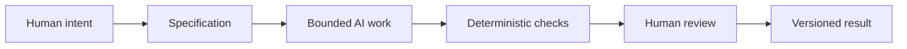

# Chapter 5: Persuasion, Archetypes, and Design Language in AI-Assisted Work

A design project is not just a collection of tasks. It is a coordinated effort to shape what people notice, what they believe, what they feel, and what they do. The same is true for AI-assisted creative and technical work. The difference is that in a human-AI workflow, the goals are easier to lose if they are not stated clearly enough.

This chapter brings together three ideas from earlier chapters:

- Persuasion helps answer: what response are we trying to enable?
- Archetype helps answer: what meaning or identity are we expressing?
- Design language helps answer: how should that meaning look and feel?

Taken together, these questions create a high-level control framework for directing work. They help a team decide what a project is trying to achieve before it begins generating content, code, copy, or interfaces.

## One Framework, Many Tasks

The same framework can guide different kinds of work.

- A poster campaign may want people to join an event, donate, or see a new identity.
- A brand system may want people to trust a product, recognize its values, and buy with confidence.
- A product page may want someone to understand a feature quickly and take action.
- A software project may want a user to complete a task with minimal confusion.
- An AI-assisted workflow may want a draft to be useful, coherent, and aligned with a clear objective.

In every case, the work is more likely to succeed when the team can answer the same three questions in plain language:

1. What response are we trying to enable?
2. What meaning or identity are we expressing?
3. How should that meaning look and feel?

Without that clarity, AI tools can produce impressive output that still misses the point.

## Persuasion: The Response We Want to Enable

Persuasion is not limited to advertising. It is part of any interface, lesson, message, workflow, or product that tries to guide attention or action.

Persuasion helps answer:

- What should the audience notice first?
- What should they trust?
- What should they understand?
- What action are we inviting, and for what reason?

A designer or team may want a person to read a page, sign up, join a movement, trust a claim, complete a form, or feel informed. These are not trivial decisions. They shape the content, structure, tone, and evidence a project needs.

In AI-assisted work, this matters because the model will produce a response based on prompts, examples, and context. If the final goal is unclear, the AI may become clever but unfocused. It may generate something polished but not aligned with the desired action. A good specification keeps the output aimed at the actual purpose.

## Archetype: The Meaning or Identity We Are Expressing

Brand archetypes help connect a product or message to a recognizable cultural role. They are not destiny, but they are useful for clarifying what a project is trying to say about itself.

Archetype helps answer:

- What kind of relationship do we want to create with the audience?
- What should the audience feel when they encounter this work?
- What identity or value system are we expressing?

An archetype can be Explorer, Sage, Rebel, Caregiver, Creator, Ruler, and so on. It can be used in marketing, product design, communication systems, or even the tone of an AI workflow. A project may be calm and precise, rebellious and disruptive, experiential and adventurous, or intellectually grounded and trustworthy.

This matters because meaning is not created by a single word or image. It grows from repeated signals: tone, structure, composition, messaging, interaction, and customer experience. An AI-generated output can become more coherent when the intended archetype is named as part of the brief.

## Design Language: How the Meaning Should Look and Feel

Visual language translates meaning into form. It determines whether the idea feels tidy and rational, emotional and expressive, playful and ironic, or confident and authoritative.

Design language helps answer:

- What should the work look like?
- What should it feel like?
- How should typography, color, rhythm, hierarchy, and layout communicate the message?
- Should the design feel restrained, disruptive, luxurious, energetic, institutional, or intimate?

A brand can say the same core product in many ways. The shirt stays the same, but the presentation changes. A product page can be modernist and quiet, or layered and ironic. A software interface can feel trustworthy and minimal, or expressive and playful. The design language is how the identity becomes visible.

AI-assisted design work is especially vulnerable to visual drift. A model may choose attractive but mismatched aesthetics because it does not know the intended mood, cultural context, or functional priorities. A clear design language reduces that drift.

## The Control Framework

The three parts work together as a decision-making system:

- persuasion sets the response intention
- archetype sets the meaning and identity
- design language sets the expression

A useful shorthand is this:

- We want this response.
- We want this meaning.
- We want it to look and feel like this.

This framework helps organize creative and technical work because it gives a project a stable center. It keeps the team from confusing style with purpose, or purpose with decoration.

## AI-Assisted Work Needs Boundaries

AI tasks should be bounded by a specification for a simple reason: when the task is underspecified, the model is allowed to improvise in ways that look polished but drift away from the actual goal.

A bounded task has clear conditions:

- the audience
- the objective
- the constraints
- the acceptable tone or style
- the required evidence or structure
- what success looks like

If a task is open-ended, the AI might create a generic answer or a highly plausible but irrelevant one. If a task is bounded, the model has a better chance of producing something useful within a defined range.

A good specification is not a cage. It is a tool for direction. It narrows the field so the AI can work effectively without losing the human purpose behind the work.

## Why Git Matters for Traceability and Recovery

Git gives the project a dependable history. It records what changed, when it changed, and who made the change. That matters for creative work because design and code are not static outputs. They evolve through revision, experimentation, and correction.

Git provides:

- traceability: it is easier to see the path of a decision
- recovery: a wrong edit can be compared, reverted, or reexamined
- collaboration: teams can work in versions without losing each other’s context
- continuity: the project can be rebuilt from its recorded history

This is especially important in AI-assisted work because the model may generate multiple draft versions quickly. Without version control, it can be hard to know which version is the right one or which output introduced a problem. Git gives a project memory. Humans still need to decide whether that memory is leading in the right direction.

## Why Deterministic Checks Are Useful

Deterministic automated checks are useful because they produce cheap, repeatable validation. They are not emotional or interpretive. They are consistent and objective.

Examples may include:

- tests for code correctness
- formatting and linting rules
- markdown or content validation
- accessibility checks
- link or asset validation
- build checks for a project

These checks are valuable because they catch obvious errors early and cheaply. A model may produce text that reads well but breaks a link, fails formatting, introduces a typo, or violates a required structure. Automated validation can repeatedly flag these issues without bias or exhaustion.

The important point is not that automation is perfect. It is that deterministic checks provide a reliable floor. They reduce uncertainty and allow the team to focus human attention on higher-level judgment.

## Why AI Review Is Useful but Probabilistic

AI review can be valuable because a second pass can often catch missing requirements, obvious inconsistencies, or weak phrasing. It can flag missing sections, unclear structure, tone mismatches, or suspicious claims. In some cases, it can help rapid iteration before humans spend time on a deeper review.

But AI review is probabilistic. It does not “know” the truth in the same way a careful human does. It predicts likely patterns based on probabilities, examples, and context. It may miss deeper problems, confidently invent details, or sound convincing while being wrong.

This is why AI review is best treated as one input among many, not as a final authority. It is useful for speed, breadth, and pattern detection. It is not a replacement for judgment.

## The Pit-Stop Metaphor for Human Review

Think of a race-car pit stop. The car cannot be driven safely without a team that keeps it moving, checks systems, and responds to problems quickly. But selected moments demand deliberate human attention: a tire change, a safety check, a strategy decision, or a final assessment of whether the car is in a condition to race.

In the same way, automation can keep running continuously:

- formatting
- linting
- tests
- version tracking
- duplicate checks
- draft review

But at selected moments, a trained human should step in for deliberate inspection. That is where judgment matters.

Human review is needed for:

- meaning and intent
- ethical decisions
- truthfulness and misinformation risks
- context and audience fit
- quality beyond what metrics can measure
- final ownership of the outcome

Automation is good at keeping the process moving. Humans are responsible for deciding whether the work is good, honest, appropriate, and worth releasing.

## Human Responsibility Remains Central

AI tools can accelerate generation and editing, but humans stay responsible for the major decisions.

Humans remain responsible for:

- judgment: deciding what counts as good work
- meaning: deciding what the work is trying to say
- truthfulness: checking claims, evidence, and accuracy
- context: understanding audience, history, culture, and stakes
- final decisions: choosing whether to ship, revise, reject, or pause

A design or technical project does not become “safe” just because an AI model produced it. It becomes usable when a human team judges it against intention, evidence, ethics, and actual conditions.

This is the essential point: AI is a contributor to the workflow, not the authority over the project.

## A Working Model

This sequence matters because it creates a rhythm of direction, generation, validation, and judgment. The AI is not asked to invent purpose from nothing. It is asked to operate within a clearly defined frame. The human team then validates the result and decides whether it is fit for release.

## Why This Matters for Creative Work

A project often fails not because the model was weak, but because the human team failed to define the problem clearly enough. The AI may create output that is attractive but misaligned, generic but not specific, or polished but dishonest. The framework above reduces those risks by making intent explicit before work begins.

It also helps teams coordinate across disciplines. A writer, designer, developer, and reviewer can discuss a project using a common vocabulary:

- What response are we trying to enable?
- What meaning do we want to express?
- How should that meaning look and feel?
- What specification defines the bounded task?
- What checks confirm the result?
- Where does human review matter most?

This prevents confusion and keeps the work aligned with the user’s real needs and values.

## Questions for Next Week

- What kinds of project decisions would benefit most from a written specification before AI is used?
- Which parts of your work are better suited to deterministic checks, and which parts require human interpretation?
- Can you name a time when a message was persuasive but not truthful?
- How do you decide when a project needs a stronger archetype or a more disciplined visual language?
- What is the most important moment in a workflow where human review should happen?

## What You Should Remember

Persuasion answers what response we want to enable. Archetype answers what meaning or identity we are expressing. Design language answers how that meaning should look and feel. Together, they form a practical control framework for creative and technical work, including AI-assisted work.

A clear specification is important because AI is best when it is bounded. Git matters because it gives traceability, recovery, and historical continuity. Deterministic automated checks are useful because they provide cheap, repeatable validation. AI review is useful but probabilistic, which means it should support human reasoning rather than replace it.

Humans remain responsible for judgment, meaning, truthfulness, context, and final decisions. In a well-run workflow, automation can keep moving while selected moments receive deliberate human inspection. That is the difference between generating output and making good work.
